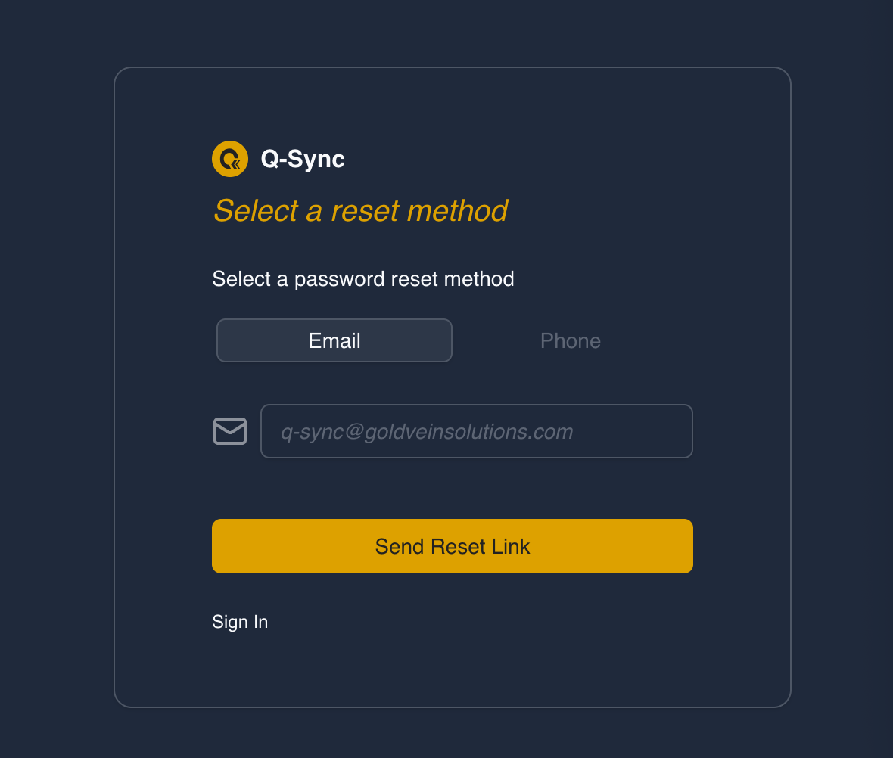
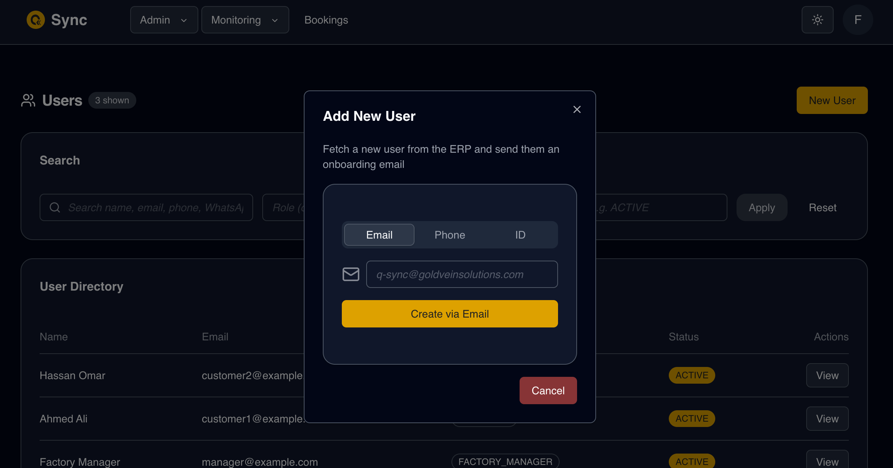

# Q-Sync Queue Management App – Account Creation Methods

The Q-Sync app provides **three primary ways** to create a new user account:

1. **Via API Integration**
2. **Via Reset Password Flow (`/forgot-password`)**
3. **Through the Admin Dashboard (`/admin/users`)**

Each method is described below.

---

## 1. Account Creation via API

### Overview

This method allows external systems or integrations (e.g., ERP systems) to create accounts programmatically by calling a secured API endpoint.

### Key Features

- **Endpoint**: `POST /api/integration/customers`
- **Authentication**: Requires a valid API key in headers (`api-key` or `Authorization: Bearer <key>`).
- **Validation**: Input is validated using a schema to ensure required fields like `customerCode`, `customerName`, `email` and/or `phone`, and optional `contractId` are correct.
- **Atomic Transactions**: Uses a database transaction to ensure consistency.

### Process Flow

1. **Validate API Key** – Only requests with valid keys are processed.
2. **Check if Customer Already Exists** – Prevents duplicate `customerCode`.
3. **Database Transaction** – Creates multiple entities atomically:
   - `User` record with role `CUSTOMER`
   - `Customer` record linked to the `User`
   - Optional `Contract` record if `contractId` is provided

4. **Audit Logging** – Logs creation action for traceability.
5. **Response** – Returns success status and the newly created `customerId`.

### Example Use Case

```json
POST /api/integration/customers
Headers: { "api-key": "<your_api_key>" }
Body:
{
  "customerCode": "CUST123",
  "customerName": "John Doe",
  "email": "john@example.com",
  "phone": "+123456789",
}
```

### Notes

- API creation ensures **atomic creation** of User, Customer, and optional Contract.
- Duplicate customer Codes result in HTTP `409 Conflict`.
- This method is intended for controlled system-to-system onboarding.

---

## 2. Account Creation via Reset Password (`/forgot-password`)



### Overview

Users can initialize their accounts themselves through the `/forgot-password` page.

Instead of traditional signup, Q-Sync uses a **verification-first model**:

- The user provides their unique identifier (`email` or `phone number`)
- The system verifies existence locally
- If not found locally, the system checks the ERP
- If verified in ERP, a new account is created in Q-Sync
- A password reset link is sent

### ERP Sync Logic

If the user does not exist locally:

```ts
const erpKey: ErpCustomerLookup =
  tab === "email" ? { email: identifier } : { phoneNumber: identifier };

const erpSyncRes = await syncCustomerFromErp(erpKey);
```

- If ERP confirms the customer → account is created
- User is instructed to retry password reset
- Reset link is then delivered

### Features

- **Multi-Tab Form** – User selects Email or Phone
- **Zod Validation** – Ensures correct input format
- **ERP Integration** – Verifies identity against ERP system
- **Controlled Delivery Channel** – Email or SMS
- **User Feedback** – Toast-based status messages

### Process Flow

1. User selects identifier type (Email or Phone).
2. System validates input format.
3. System checks local database.
4. If not found → checks ERP.
5. If found in ERP → creates local account.
6. Sends password reset link for credential setup.

### Notes

- This flow doubles as a **secure onboarding mechanism**.
- No account is created unless the user is verified against ERP data.
- Prevents unauthorized or fake account creation.

---

## 3. Account Creation via Admin Dashboard



### Overview

Administrators can onboard users directly through the **Users UI** in the dashboard.

### Features

- **Identifier-Based Creation** – Email, phone number, or customer ID.
- **ERP-Backed Validation** – Admin-triggered ERP sync.
- **Password Initialization** – Sends reset link for first login.
- **UI Feedback** – Displays confirmation or error messages.

### Process Flow

1. Admin provides user identifier (email, phone, or customerId).
2. System validates format.
3. Submission triggers `syncCustomerFromErp`.
4. If verified → creates local account.
5. Sends reset-password link via selected delivery channel.
6. Displays confirmation or error messages.

### Notes

- Admin flow mirrors reset-password logic but is manually initiated.
- Ensures users cannot be created without ERP verification.

---

# Architectural Principle: Controlled Onboarding & Data Minimization

To prevent:

- Resource misuse
- Database cost ballooning
- Storage of unused accounts
- “Zombie” data (inactive or orphaned records)

**Q-Sync does NOT automatically import or host all ERP customer data.**

Instead, Q-Sync relies on **explicit onboarding triggers**, initiated by:

- An ERP system (via API integration)
- An end user (via reset-password flow)
- An administrator (via dashboard UI)

This ensures:

- Only actively used accounts exist in Q-Sync
- Database growth remains controlled
- Operational costs remain optimized
- Data remains relevant and actively used

This deliberate onboarding strategy supports long-term scalability and cost efficiency.

---

# Summary Comparison

| Method              | Initiator       | Validation          | ERP Integration                   | Feedback      |
| ------------------- | --------------- | ------------------- | --------------------------------- | ------------- |
| API                 | External system | Schema + DB checks  | Mandatory (validated data source) | JSON response |
| Reset-Password Flow | End user        | Schema + ERP lookup | Conditional (if not local)        | UI (toast)    |
| Admin Dashboard     | Admin user      | Schema + ERP lookup | Triggered by admin                | UI            |

---

# Key Take-aways

1. All methods ensure **data integrity** and prevent duplicate customer creation.
2. ERP integration is central to identity verification.
3. Account creation is always **explicitly triggered**, never bulk-imported.
4. The system enforces a **verification-first onboarding model**.
5. The architecture prevents unnecessary database growth and zombie accounts.
