# Q-Sync Design Document

## Persona-Specific Workflows

**Date:** February 11, 2026

---

## Table of Contents

1. [Truck Owner Flows](#truck-owner-flows)
2. [Factory Manager Flows](#factory-manager-flows)
3. [Factory Guard Flows](#factory-guard-flows)
4. [System Admin Flows](#system-admin-flows)

---

## Truck Owner Flows

### Flow 1: Complete Onboarding Journey

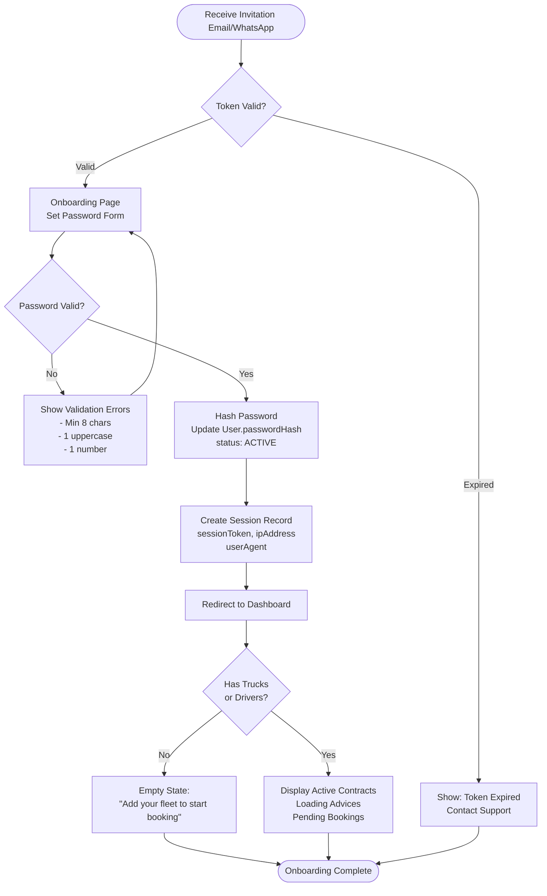

---

### Flow 2: Fleet Registration (Truck)

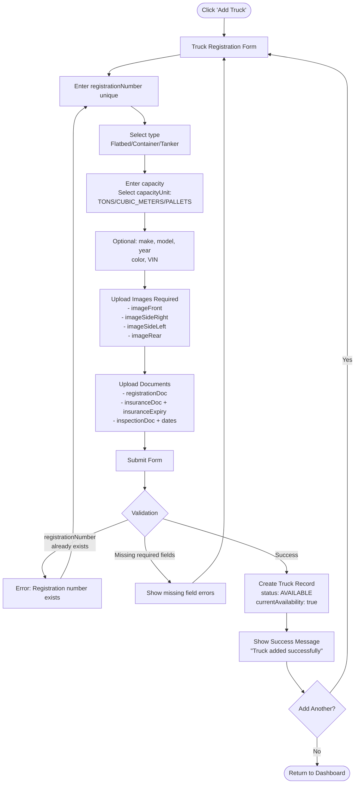

---

### Flow 3: Create Booking (Multi-Truck)

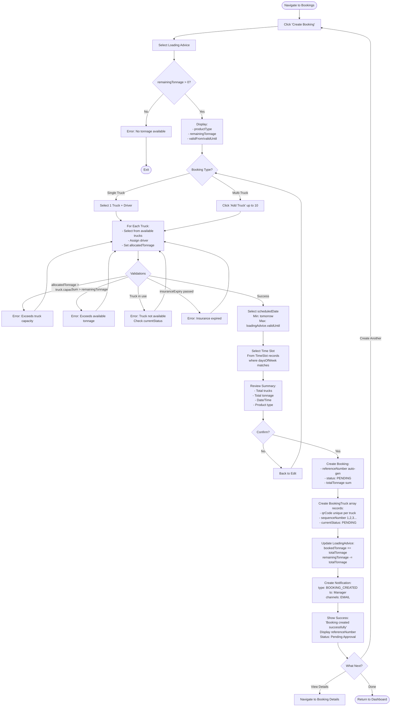

---

### Flow 4: Monitor Booking Status

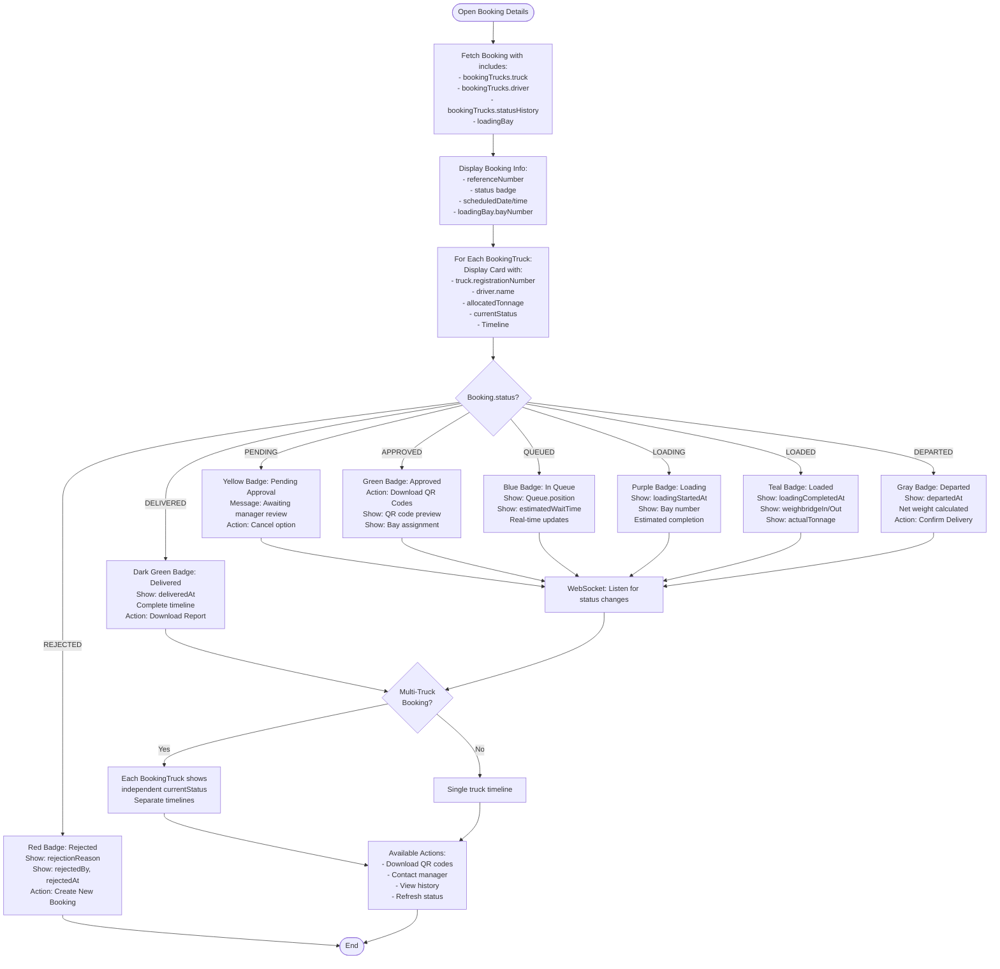

---

## Factory Manager Flows

### Flow 5: Issue Loading Advice

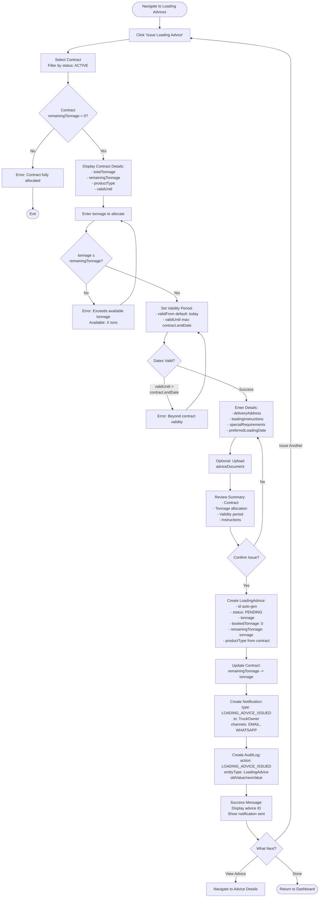

---

### Flow 6: Approve/Reject Booking

```mermaid
flowchart TD
    Start([View Pending Approvals]) --> LoadBooking[Load Booking where:<br/>status: PENDING<br/>approvedById: null]

    LoadBooking --> ShowDetails[Display Full Details:<br/>- Booking info<br/>- LoadingAdvice<br/>- Contract<br/>- All BookingTrucks]

    ShowDetails --> CheckDocs[For Each BookingTruck:<br/>Validate Documents]

    CheckDocs --> Doc1{truck.registrationDoc<br/>exists?}
    Doc1 -->|No| MarkInvalid1[❌ Registration missing]
    Doc1 -->|Yes| Doc2{truck.insuranceDoc<br/>exists?}

    Doc2 -->|No| MarkInvalid2[❌ Insurance missing]
    Doc2 -->|Yes| Doc3{insuranceExpiry ><br/>today?}

    Doc3 -->|No| MarkExpired[⚠️ Insurance expired]
    Doc3 -->|Yes| Doc4{driver.licenseDoc<br/>exists?}

    Doc4 -->|No| MarkInvalid3[❌ License missing]
    Doc4 -->|Yes| Doc5{driver.licenseExpiry ><br/>today?}

    Doc5 -->|No| MarkExpired2[⚠️ License expired]
    Doc5 -->|Yes| MarkValid[✅ All documents valid]

    MarkInvalid1 --> ShowChecklist
    MarkInvalid2 --> ShowChecklist
    MarkInvalid3 --> ShowChecklist
    MarkExpired --> ShowChecklist
    MarkExpired2 --> ShowChecklist
    MarkValid --> ShowChecklist

    ShowChecklist[Display Validation Checklist:<br/>Document status per truck]

    ShowChecklist --> CheckTonnage{totalTonnage ≤<br/>loadingAdvice<br/>.remainingTonnage?}

    CheckTonnage -->|No| ShowTonnageError[⚠️ Exceeds available tonnage]
    CheckTonnage -->|Yes| CheckProduct{productType matches<br/>available bays?}

    ShowTonnageError --> Decision
    CheckProduct -->|No| ShowProductError[⚠️ No compatible bay available]
    CheckProduct -->|Yes| ShowAllGood[✅ Ready for approval]

    ShowProductError --> Decision
    ShowAllGood --> Decision{Manager Decision}

    Decision -->|Reject| RejectFlow[Enter Rejection]
    Decision -->|Approve| ApproveFlow[Assign Bay]

    RejectFlow --> SelectReason[Select rejectionReason:<br/>- Insufficient documentation<br/>- Invalid documents<br/>- Tonnage exceeds limit<br/>- Bay unavailable<br/>- Other]

    SelectReason --> EnterComment[Enter detailed explanation]

    EnterComment --> ConfirmReject{Confirm Rejection?}
    ConfirmReject -->|No| Decision

    ConfirmReject -->|Yes| UpdateReject[Update Booking:<br/>- status: REJECTED<br/>- rejectedBy: manager.id<br/>- rejectedAt: now<br/>- rejectionReason]

    UpdateReject --> NotifyReject[Create Notification:<br/>type: BOOKING_REJECTED<br/>to: TruckOwner<br/>channels: EMAIL, WHATSAPP]

    NotifyReject --> AuditReject[Create AuditLog:<br/>action: BOOKING_REJECTED]

    AuditReject --> ShowRejectSuccess[Success: Booking rejected<br/>Owner notified]
    ShowRejectSuccess --> End([Done])

    ApproveFlow --> SelectBay[Select Loading Bay<br/>Filter by:<br/>- status: AVAILABLE<br/>- productType in allowedProducts]

    SelectBay --> SetPriority{Set Priority?}
    SetPriority -->|Yes| MarkPriority[Set BookingTruck.isPriority: true]
    SetPriority -->|No| SkipPriority[Keep isPriority: false]

    MarkPriority --> EnterNotes
    SkipPriority --> EnterNotes[Optional: Enter managerNotes]

    EnterNotes --> ConfirmApprove{Confirm Approval?}
    ConfirmApprove -->|No| Decision

    ConfirmApprove -->|Yes| UpdateBooking[Update Booking:<br/>- status: APPROVED<br/>- approvedById: manager.id<br/>- approvedAt: now<br/>- loadingBayId]

    UpdateBooking --> UpdateTrucks[Update All BookingTrucks:<br/>- currentStatus: APPROVED<br/>- qrCode already exists]

    UpdateTrucks --> UpdateBay[Update LoadingBay:<br/>- status: OCCUPIED]

    UpdateBay --> CreateBayHistory[Create LoadingBayHistory:<br/>- fromStatus: AVAILABLE<br/>- toStatus: OCCUPIED<br/>- changedById: manager.id]

    CreateBayHistory --> NotifyApprove[Create Notification:<br/>type: BOOKING_APPROVED<br/>to: TruckOwner<br/>channels: EMAIL, WHATSAPP<br/>Include QR codes]

    NotifyApprove --> AuditApprove[Create AuditLog:<br/>action: BOOKING_APPROVED]

    AuditApprove --> ShowSuccess[Success: Booking approved<br/>QR codes sent<br/>Bay assigned]

    ShowSuccess --> NextBooking{More Pending?}
    NextBooking -->|Yes| LoadBooking
    NextBooking -->|No| End
```

---

### Flow 7: Monitor Queue & Manage Bays

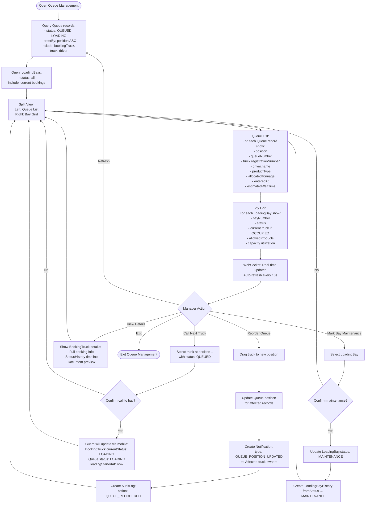

---

## Factory Guard Flows

### Flow 8: QR Code Check-In

```mermaid
flowchart TD
    Start([Open Mobile Scanner]) --> Camera[Activate Camera<br/>Show scanning frame overlay]

    Camera --> ScanQR[Guard points camera<br/>at truck's QR code]

    ScanQR --> ReadCode{QR Code Detected?}
    ReadCode -->|No| Camera

    ReadCode -->|Yes| Vibrate[Haptic feedback<br/>Beep sound]

    Vibrate --> QueryDB[Query BookingTruck<br/>where qrCode = scanned]

    QueryDB --> CheckExists{Record Found?}

    CheckExists -->|No| ShowInvalid[❌ Invalid QR Code<br/>Red screen<br/>Error sound]
    ShowInvalid --> Options1{Guard Action}
    Options1 -->|Retry| Camera
    Options1 -->|Manual Entry| ManualEntry[Enter booking reference<br/>or truck registration]
    Options1 -->|Contact Manager| CallManager[Show manager contact<br/>WhatsApp/Phone buttons]
    CallManager --> End([Exit])
    ManualEntry --> SearchDB[Search Booking/BookingTruck]
    SearchDB --> CheckExists

    CheckExists -->|Yes| LoadDetails[Load Full Record:<br/>Include: booking, truck<br/>driver, loadingAdvice<br/>loadingBay]

    LoadDetails --> CheckStatus{currentStatus?}

    CheckStatus -->|Not APPROVED| ShowError[❌ Cannot Check In<br/>Status: currentStatus<br/>Must be APPROVED]
    ShowError --> End

    CheckStatus -->|APPROVED| CheckSchedule{scheduledDate ≈<br/>today?}

    CheckSchedule -->|> 2 hours early| ShowEarly[⚠️ Early Arrival<br/>Scheduled: scheduledDate<br/>Current: now<br/>Options:<br/>1. Check in anyway<br/>2. Direct to parking]
    ShowEarly --> EarlyChoice{Guard Choice}
    EarlyChoice -->|Parking| SendParking[Show parking directions<br/>Log early arrival]
    SendParking --> End
    EarlyChoice -->|Check In| ShowDetails

    CheckSchedule -->|On time<br/>or late| ShowDetails[✅ Valid Check-In<br/>Green screen<br/>Display:<br/>- referenceNumber<br/>- truck.registrationNumber<br/>- driver.name<br/>- productType<br/>- allocatedTonnage<br/>- loadingBay.bayNumber]

    ShowDetails --> VerifyDriver[Guard verifies:<br/>Driver ID matches<br/>driver.name]

    VerifyDriver --> ConfirmCheckIn{Confirm Check-In?}
    ConfirmCheckIn -->|No| Camera

    ConfirmCheckIn -->|Yes| Transaction[Start Database Transaction]

    Transaction --> Update1[Update BookingTruck:<br/>- currentStatus: QUEUED<br/>- checkedInAt: now]

    Update1 --> CalcPosition[Calculate Queue Position:<br/>Get max position + 1<br/>or use isPriority for priority]

    CalcPosition --> CreateQueue[Create Queue record:<br/>- queueNumber unique<br/>- position<br/>- isPriority<br/>- enteredAt: now<br/>- status: QUEUED]

    CreateQueue --> CreateHistory[Create StatusHistory:<br/>- fromStatus: APPROVED<br/>- toStatus: QUEUED<br/>- updatedBy: guard.id<br/>- location: &apos;Factory Gate&apos;<br/>- timestamp: now]

    CreateHistory --> CreateNotif[Create Notification:<br/>type: TRUCK_CHECKED_IN<br/>to: TruckOwner<br/>channels: WHATSAPP<br/>message:&apos;Queue position: X&apos;]

    CreateNotif --> CommitTx[Commit Transaction]

    CommitTx --> ShowSuccess[✅ Check-In Successful<br/>Display:<br/>- Queue position<br/>- Estimated wait time<br/>- Bay assignment<br/>- Directions to waiting area]

    ShowSuccess --> PrintGate{Print Gate Pass?}
    PrintGate -->|Yes| PrintPass[Generate & Print:<br/>- Truck registration<br/>- Queue number<br/>- Time in<br/>- Bay assignment]
    PrintGate -->|No| SkipPrint

    PrintPass --> AutoReturn[Auto-return to scanner<br/>after 3 seconds]
    SkipPrint --> AutoReturn

    AutoReturn --> Camera
```

---

### Flow 9: Update Truck Status (Loading → Departed)

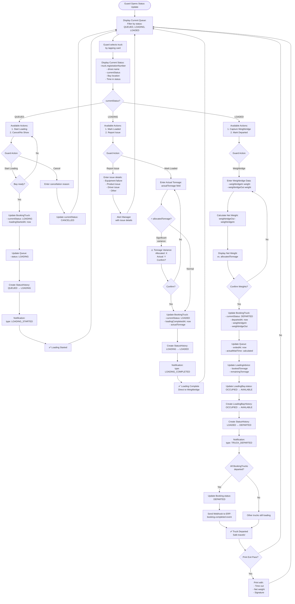

---

## System Admin Flows

### Flow 10: Create API Key for ERP Integration

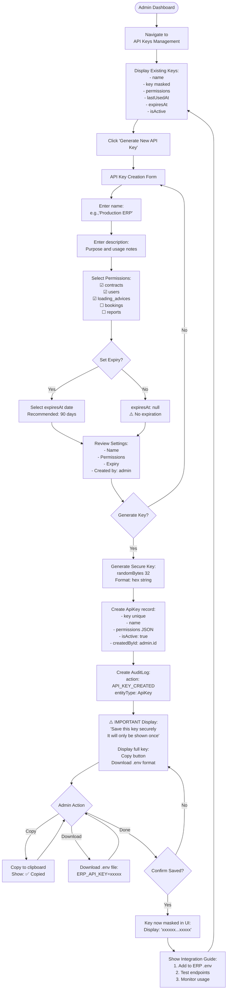

---

### Flow 11: User Management - Create Truck Owner

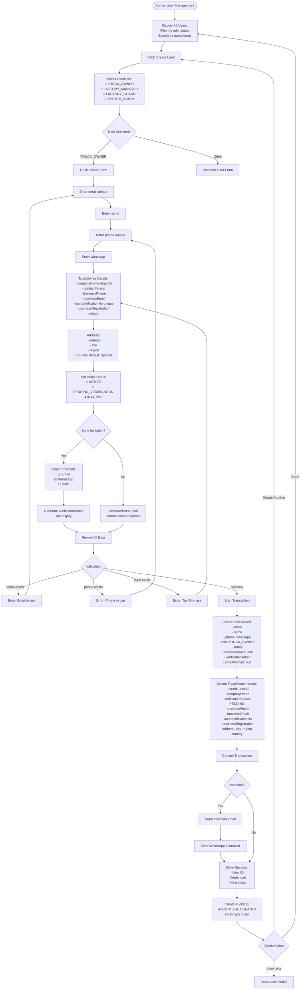

---

### Flow 12: System Configuration - Time Slots

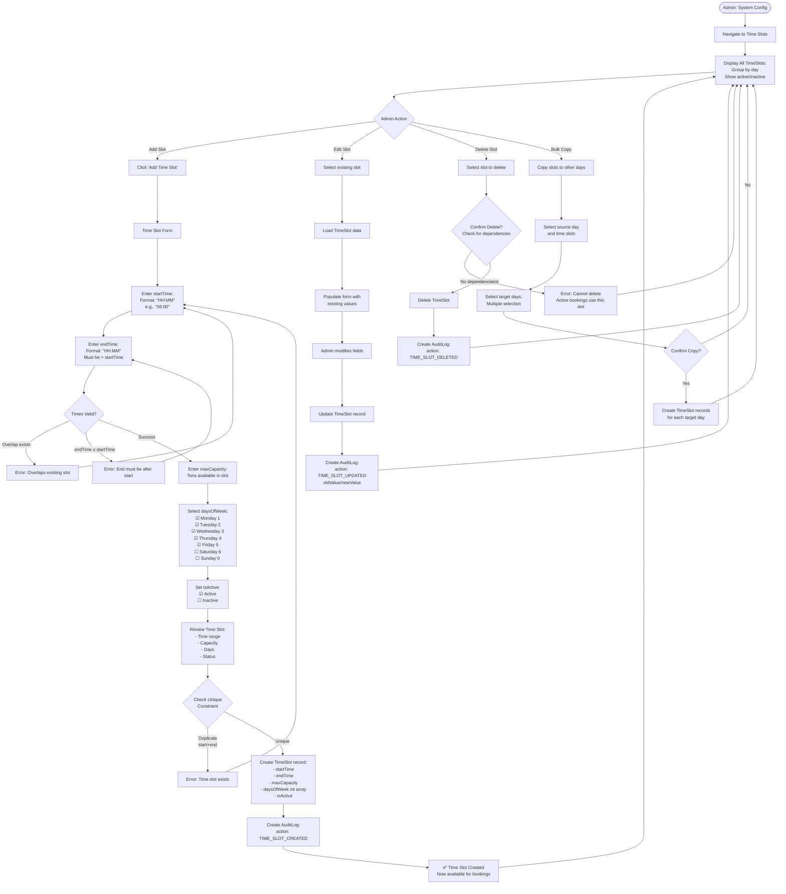

---

## Cross-Persona Interaction Flows

### Flow 13: Complete Lifecycle (All Personas)

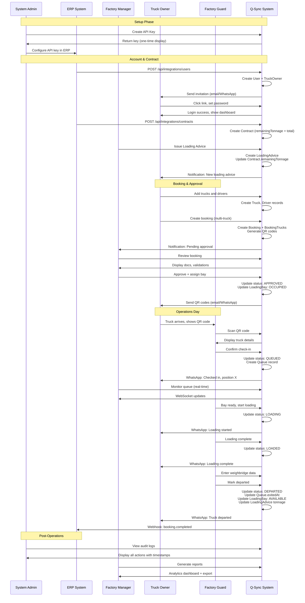

---
